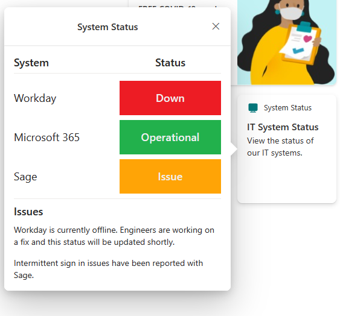

# Viva Connections 'System Status' Card

A low-code proof of concept card built with the Card Designer that uses the new Advance API Features (https://learn.microsoft.com/en-us/sharepoint/dev/spfx/viva/features/card-designer/card-designer-api-support) to display IT system statuses.

It uses the SharePoint REST API and a SharePoint list. Conditional formatting is used in the template JSON, for example to apply different background images based on the status of the system (base64 encoded images).

Feel free to customise to your needs.

## Deployment

To deploy the solution as is, follow the steps below:

1. Configure the new Advance API Features by following the steps in the documentation above.
2. Create a SharePoint list in your Viva Connections home site named 'SystemStatus' with the following columns (ensure the internal names of the columns do not contain spaces):

   - System Name (Single line of text)
   - Status (Choice): 'Down','Operational','Issue'
   - Status Descrption (Single line of text)

3. Populate the list with some example list items with a varierty of statuses.

4. Add a Card Designer card to your dashboard and configure it as follows:

- Card Size: Medium
- Template type: Description
- Title: System Status
- Icon: Desktop
- Heading: IT System Status
- Description: Check the status of our IT systems.
- Card action: Show the quick view
- Template JSON: Copy and paste the provided template JSON from this repo (ac-quickview-systemstatus-template.json)
- Data source: Call a SharePoint API
- Request URL: lists/GetByTitle('SystemStatus')/items

4. Apply the changes to the card and republish your dashboard.
5. Clicking on the card should show the quick view and the items from your list.
